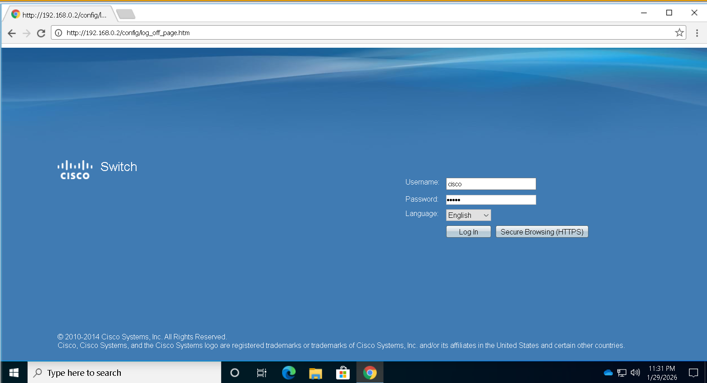
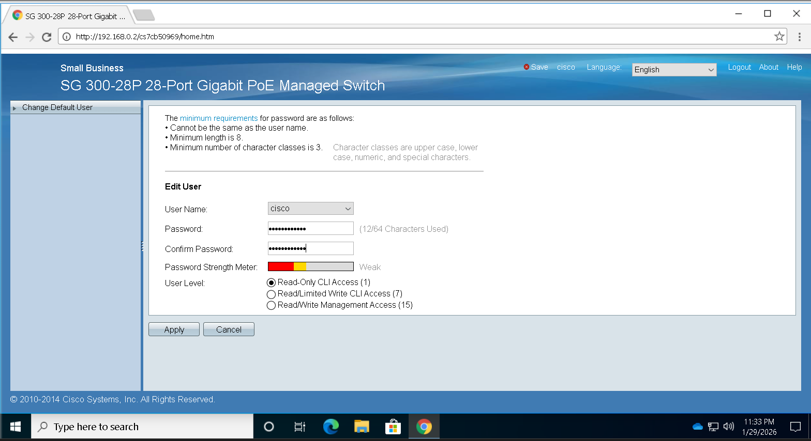
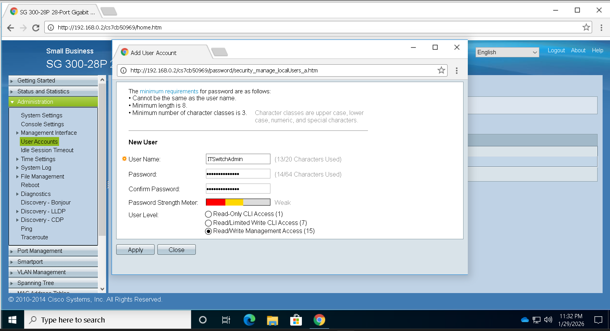
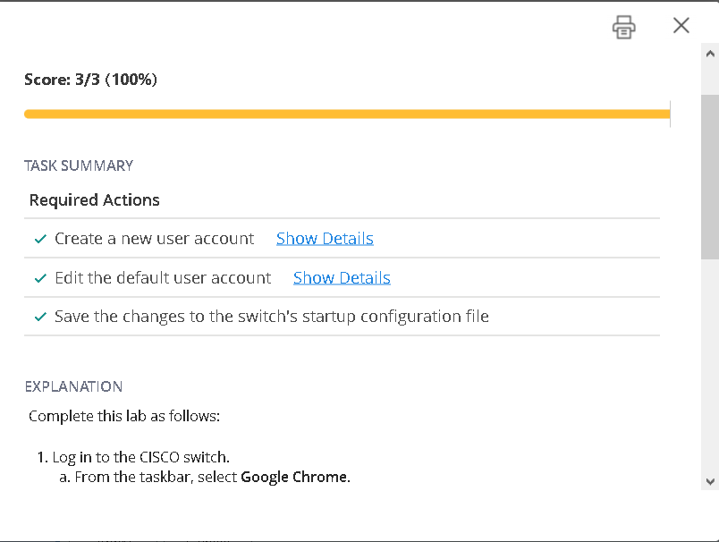
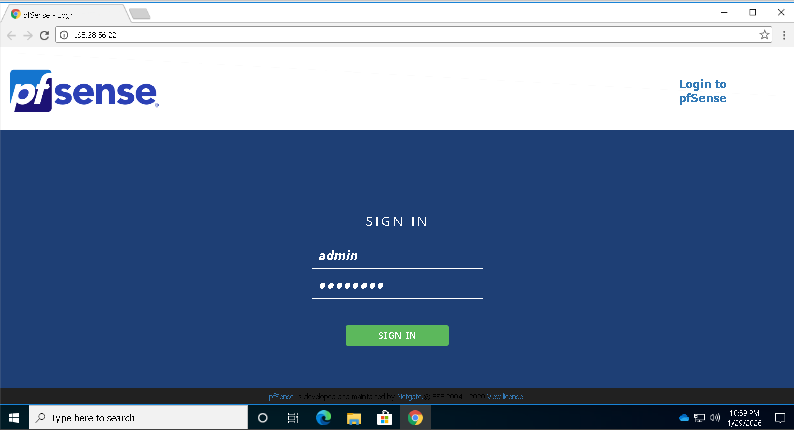
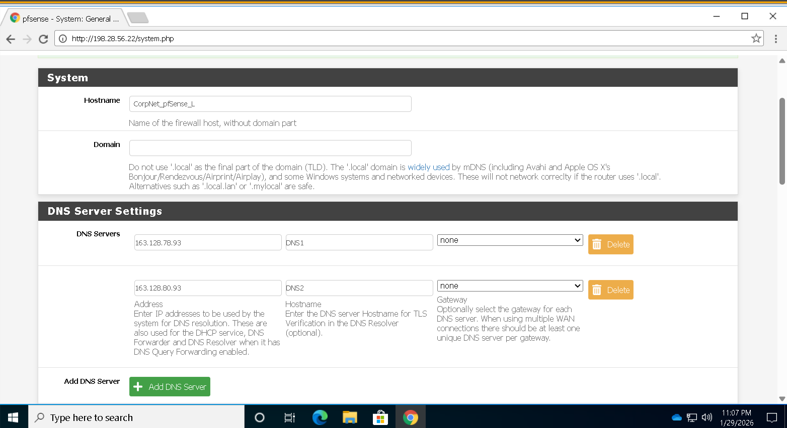
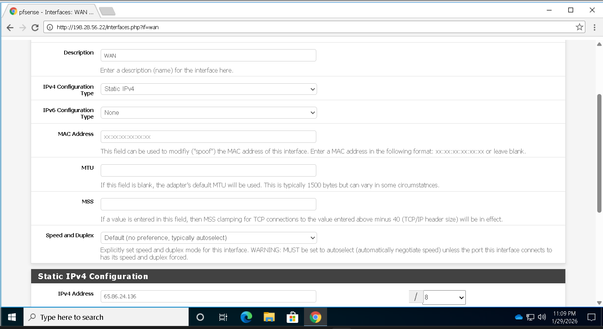
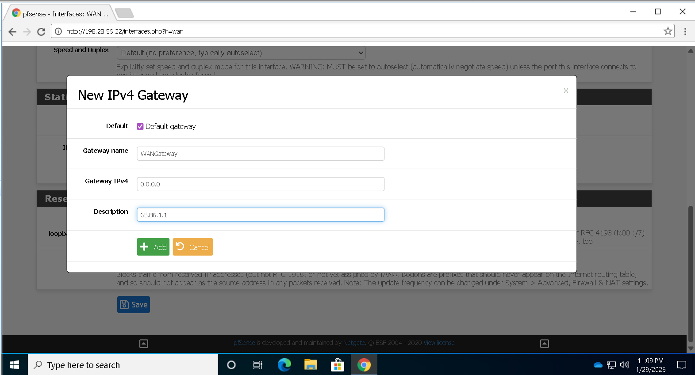
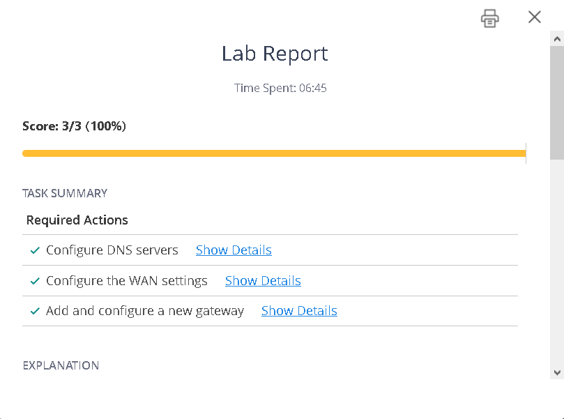

# 🔒 Network Security Labs

> **หลักสูตร:** IT Security Administration
> **ระดับ:** Network Infrastructure Security

---

## 📋 สารบัญ

- [Lab 5.7.6 — Secure a Switch](#lab-576--secure-a-switch)
- [Lab 5.2.7 — Configure a Security Appliance](#lab-527--configure-a-security-appliance)

---

## Lab 5.7.6 — Secure a Switch

### บทบาท
> คุณคือ **ผู้ดูแลระบบความปลอดภัยด้านไอที (IT Security Administrator)** ของเครือข่ายองค์กรขนาดเล็ก
> ภารกิจ: รักษาความปลอดภัยในการเข้าถึงสวิตช์ที่ยังใช้การตั้งค่าเริ่มต้นจากโรงงาน

### การเข้าสู่ระบบเริ่มต้น

| รายการ | ค่า |
|--------|-----|
| URL | `http://192.168.0.2/` |
| Username | `cisco` |
| Password | `cisco` |

> เปิดผ่านโปรแกรม **Chrome**

---

### งานที่ต้องทำ

#### ✅ ภารกิจที่ 1 — สร้างบัญชีผู้ใช้ใหม่

| รายการ | ค่า |
|--------|-----|
| Username | `ITSwitchAdmin` |
| Password | `Admin$only1844` |
| User Level | **Read/Write Management Access (ระดับ 15)** |



---

#### ✅ ภารกิจที่ 2 — แก้ไขบัญชีผู้ใช้เริ่มต้น

| รายการ | ค่า |
|--------|-----|
| Username | `cisco` |
| Password | `CLI$only1958` |
| User Level | **Read-Only CLI Access (ระดับ 1)** |



---

#### ✅ ภารกิจที่ 3 — ขั้นตอนการสร้าง User ใหม่ (ITSwitchAdmin)

**1. เข้าเมนู**
```
Administration → User Accounts
(บางรุ่น: Security → User Management)
```

**2. คลิก** `Add` / `Add New User`

**3. กรอกข้อมูล**

```
Username         : ITSwitchAdmin
Password         : Admin$only1844
Confirm Password : Admin$only1844
User Level       : Read/Write Management Access (15)
```

**4. คลิก** `Apply` / `Save`



**สำเร็จ ✔**



---

## Lab 5.2.7 — Configure a Security Appliance

### บทบาท
> คุณเป็น **ผู้ดูแลระบบความปลอดภัยด้านไอที** สำหรับเครือข่ายองค์กรขนาดเล็ก
> ภารกิจ: กำหนดค่าอุปกรณ์รักษาความปลอดภัยเครือข่าย **pfSense**

---

### งานที่ต้องทำ

#### ✅ ภารกิจที่ 1 — เข้าสู่ระบบ pfSense

| รายการ | ค่า |
|--------|-----|
| URL | `http://198.28.56.22` |
| Username | `admin` |
| Password | `P@ssw0rd` |



---

#### ✅ ภารกิจที่ 2 — กำหนดค่า DNS Server

**Primary DNS Server**

| รายการ | ค่า |
|--------|-----|
| IP Address | `163.128.78.93` |
| Hostname | `DNS1` |

**Secondary DNS Server**

| รายการ | ค่า |
|--------|-----|
| IP Address | `163.128.80.93` |
| Hostname | `DNS2` |

---

#### ✅ ภารกิจที่ 3 — กำหนดค่า WAN IPv4

```
เปิดใช้งานอินเทอร์เฟซ (Enable the interface)
Static IPv4 Address : 65.86.24.136/8
```




---

#### ✅ ภารกิจที่ 4 — เพิ่ม Gateway

| รายการ | ค่า |
|--------|-----|
| Type | `Default Gateway` |
| Name | `WANGateway` |
| IP Address | `65.86.1.1` |



**สำเร็จ ✔**



---

*จัดทำโดย IT Security Lab · อัปเดต 29 มกราคม 2569*
